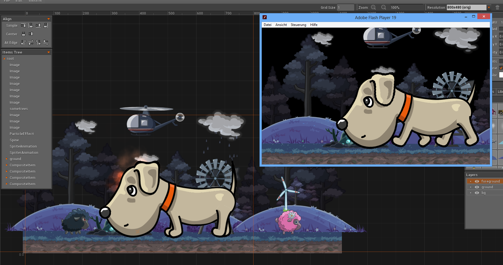

# overlay2d-runtime-kha-basicg2



- very rudimentary runtime library build for kha/g2
- mainly to render stuff and see if the haxe-format-o2d parsing works
- probably won't ever be a full fledged runtime b/c everyone and their mom has their own engine/framework/ecs-system, and it doesn't make sense to try and reinvent the wheel once again
- you can use it as learning resource on how to iterate the parsed data though
- or maybe something like a builder/factory would make sense so other engines could easily customize a simple wrapper to convert the data to their preferred runtime format?
 - but might just be a waste of effort as it's probably done in 20 loc anyway?

```haxe
interface O2dSomething {
	function onImage( i : O2dImageItem ) : Void;
	function onEnterComposite( c : O2dCompositeItem ) : Void;
	function onLeaveComposite( c : O2dCompositeItem ) : Void;
}

class AshECSAdapter implements O2dSomething {
	public function new( ash : Engine ) { ... }

	public function onImage( i : O2dImageItem ) {
		// create entity/components depending on whatever
	}

	public function onEnterComposite( c ) {
		// create a player entity now
		if (c.tags.indexOf('player') != -1) {
			ash.addEntity(...);
		}

		// all items until onLeaveComposite() go into player components now ... or something
	}
}

class Main {
	public static function main() {
		var project : O2dProject = ...;
		var myAshEngine : ash.core.Engine = ...;
		O2dHierarchyWalker.walk(project, new AshECSAdapter(myAshEngine));
	}
}
```
